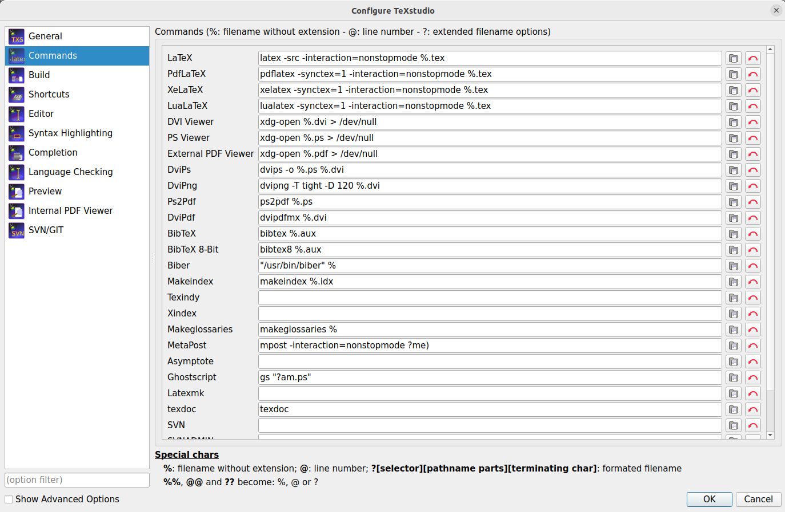
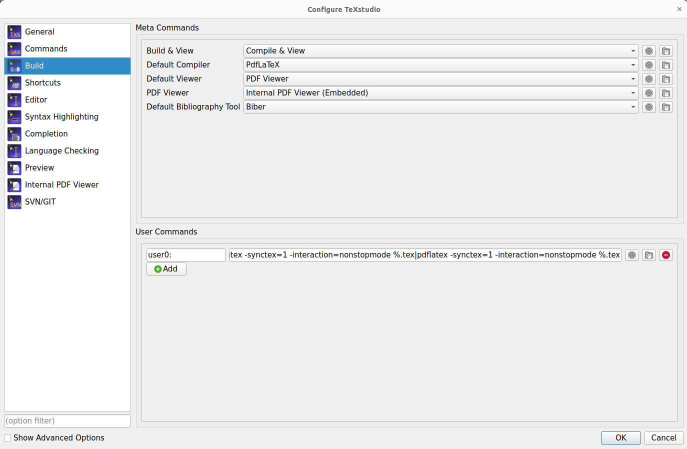

# My Latex Notes/Book Template

## Pre-requisites
I am using Ubuntu 22.04 with following requisites:
- Texlive installed using command `sudo apt install texlive-latex-extra`
- Textstudio as editor installed using `sudo apt-get -y autoremove texstudio`
- Other necessary subpackages installed using:
```bash
sudo apt-get install texlive-fonts-extra
sudo apt-get install texlive-formats-extra
sudo apt-get install texlive-publishers
sudo apt-get install texlive-science
sudo apt-get install texlive-bibtex-extra
```
- Note: in case of a a missing `*.sty` file, search using `sudo apt-cache search xifthen`
- `biber` as a backend installed using `sudo apt install biber`

## TeXstudio settings

